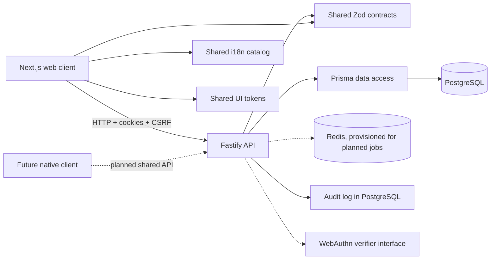

# Architecture

## Status

This document describes the current web-first MVP architecture and the planned
target architecture. The current system is a modular monolith: one web app, one
API process, one PostgreSQL database, and shared TypeScript packages. The planned
features below are intentionally marked as not implemented.

## Design goals

- Keep the server authoritative for membership, schedule, and shift state.
- Keep team membership and authorization scoped per team, so one user can have
  different roles in different teams.
- Keep high-contention operations transactional and conflict-safe.
- Share contracts, localization identifiers, and design tokens between clients.
- Keep external providers behind replaceable interfaces.
- Prefer a modular monolith for the pilot scale instead of introducing service
  boundaries that the product does not yet need.

## Current system shape



### Applications and packages

| Area       | Location             | Responsibility                                                                                 | Current state                                                                                               |
| ---------- | -------------------- | ---------------------------------------------------------------------------------------------- | ----------------------------------------------------------------------------------------------------------- |
| Web client | `apps/web`           | Next.js App Router pages, responsive UI, cookies/CSRF API client, English/Hebrew and RTL shell | Implemented for onboarding, home, and parent schedule flows                                                 |
| API        | `apps/api`           | Fastify routes, authorization, validation, transactions, audit writes, Prisma integration      | Implemented for identity, membership, schedule, collection points, sessions, and atomic shift claim/release |
| Contracts  | `packages/contracts` | Zod request/response schemas and shared domain types                                           | Implemented and tested                                                                                      |
| i18n       | `packages/i18n`      | English/Hebrew messages, locale helpers, RTL direction, date/number helpers                    | Implemented; Hebrew copy still needs native-speaker review                                                  |
| UI tokens  | `packages/ui-tokens` | Cross-platform semantic design tokens for status, focus, spacing, motion, and typography       | Implemented and tested                                                                                      |
| Config     | `packages/config`    | Shared TypeScript and ESLint configuration                                                     | Implemented                                                                                                 |

## Runtime boundaries

### Web to API

The web client calls the API through `apps/web/src/lib/api.ts`. Requests use
`credentials: 'include'` so browser sessions use the `soccer_session` httpOnly
cookie. Mutating cookie-authenticated requests include the readable
`soccer_csrf` value in the `x-csrf-token` header. The API also retains bearer
session-token support for tests and future non-browser clients.

The web and API must be same-site when deployed, such as
`app.example.com` and `api.example.com`; cookie authentication is not designed
for unrelated registrable domains.

### API modules

Fastify registers the following route modules in `apps/api/src/app.ts`:

| Module             | Main responsibilities                                                                                                                            |
| ------------------ | ------------------------------------------------------------------------------------------------------------------------------------------------ |
| Health             | Liveness and database readiness checks                                                                                                           |
| Teams              | Team bootstrap and basic team lookup                                                                                                             |
| Auth               | Passkey login (identifier-first) and registration (for an already-authenticated user), session inspection, logout                                |
| Invites            | Admin invite creation, preview, atomic acceptance, and the invite-scoped passkey registration a brand-new parent completes right after accepting |
| Members            | Team member list, role changes, and removal with last-admin protection                                                                           |
| Push subscriptions | Browser push subscription registration/removal; delivery is not yet implemented                                                                  |
| Collection points  | Team collection-point CRUD                                                                                                                       |
| Schedule templates | RRULE parsing, horizon generation, and session/shift creation                                                                                    |
| Sessions           | Schedule listing, admin session updates/cancellation, point player assignments                                                                   |
| Shifts             | Version-gated claim and release                                                                                                                  |

All route inputs are validated with Zod. Team-scoped routes authorize the current
user through `requireTeamRole` before reading or mutating team data.

## Domain model

The Prisma schema in `apps/api/prisma/schema.prisma` is the system of record.

```text
User
  -> TeamMember -> Team
  -> PlayerParent -> Player -> Team
  -> Session / Passkey / WebauthnChallenge / PushSubscription

Team
  -> CollectionPoint
  -> ScheduleTemplate -> PracticeSession
  -> SessionPointAssignment
  -> Shift
  -> Invite / NotificationPreference / AuditLog
```

Important modeling choices:

- `TeamMember.role` stores `parent` or `admin` per team, not globally on `User`.
- `Team.timezone` defaults to `Asia/Jerusalem` and is the intended basis for
  schedule and escalation behavior.
- A schedule template stores an RRULE, start date, default time/location,
  horizon, and default collection points.
- A generated `PracticeSession` can be edited or cancelled independently of its
  template. Historical records remain available.
- `SessionPointAssignment` stores the players attached to a point and direction.
- `Shift` is the independently claimable unit. A `both` collection point creates
  separate `to_practice` and `from_practice` shifts.
- `Shift.version` is incremented on state changes and participates in compare-
  and-set updates.
- `AuditLog` records meaningful mutations with actor, target, before state, and
  after state.

## Critical write flows

### Invite acceptance

1. The admin creates an invite inside a team-scoped transaction.
2. The invite code can be previewed without authentication to show the team name.
3. Acceptance validates the invite state and creates or reuses the user,
   membership, and linked players atomically.
4. The invite transitions from `pending` to `accepted`.
5. An audit record is written in the same transaction.
6. Concurrent acceptance attempts are rejected rather than creating duplicate
   membership state.

### Shift claim and release

1. Authenticate the caller and authorize membership in the team.
2. Load the shift and verify that its session is still scheduled.
3. In a transaction, update only when the expected `version` and current status
   still match.
4. If the conditional update affects zero rows, return a friendly `409` conflict
   rather than overwriting the winning claim.
5. Increment the version and write an audit entry in the same transaction.

This compare-and-set rule prevents double assignment and also protects against
an older request winning after a release-and-reclaim cycle.

## Security and operational controls

- Login and registration use WebAuthn passkeys, not a password or an SMS/email
  one-time code — no external delivery vendor is required.
- A brand-new parent's first passkey registration is scoped to their specific
  invite code (not a bare user ID) and bounded to a short window after
  acceptance, so a captured invite link can't be used to attach a credential
  to the account indefinitely.
- Browser sessions use an httpOnly cookie plus double-submit CSRF protection.
- Authorization is checked at the team boundary and admin-only commands are
  explicit.
- Removing a team's last admin is rejected.
- Invite acceptance, membership changes, team creation, schedule changes, and
  shift claim/release write audit records.
- The real WebAuthn ceremony (`@simplewebauthn/server`) sits behind an
  injectable `WebauthnVerifier` interface, the same pattern used for any
  external provider — tests substitute a fake verifier since a real ceremony
  needs actual browser/authenticator crypto.

## Planned architecture

The following are target capabilities, not current runtime behavior:

- Add Swap, Notifications, Reminders, Escalations, Reporting, and AI modules to
  the same modular API process.
- Add a transactional outbox and Redis/BullMQ workers for retries, scheduled
  reminders, swap expiry, escalation processing, and notification fan-out.
- Deliver browser push and in-app notifications through provider adapters, with
  optional email/SMS channels after the hosting/provider decisions are made.
- Add admin UI for schedule templates, collection points, roster assignment,
  member operations, reporting, and future-session bulk edits.
- Add Playwright end-to-end coverage, accessibility scans, security checks, and
  load/concurrency checks before pilot release.
- Add `apps/mobile` with Expo/React Native only after the web API and flows are
  stable. Native clients should reuse contracts, i18n, tokens, and server-side
  commands rather than duplicate business rules.

For sequencing and explicit deferred scope, see [PLAN.md](../PLAN.md).
