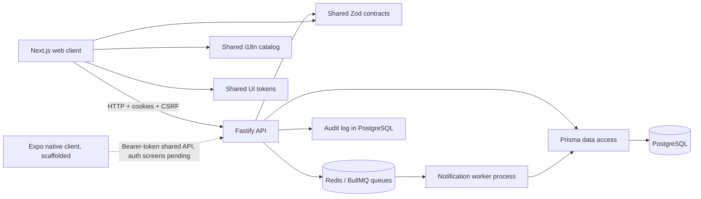

# Architecture

## Status

This document describes the current web-first MVP architecture and the planned
target architecture. The current system is a modular monolith: one web app, one
API process, one PostgreSQL database, and shared TypeScript packages. The planned
features below are intentionally marked as not implemented.

## Design goals

- Keep the server authoritative for membership, schedule, and shift state.
- Keep team membership and authorization scoped per team, so one user can have
  different roles in different teams.
- Keep high-contention operations transactional and conflict-safe.
- Share contracts, localization identifiers, and design tokens between clients.
- Keep external providers behind replaceable interfaces.
- Prefer a modular monolith for the pilot scale instead of introducing service
  boundaries that the product does not yet need.

## Current system shape



### Applications and packages

| Area                | Location              | Responsibility                                                                                                                                                                                                                               | Current state                                                                                                                                                                       |
| ------------------- | --------------------- | -------------------------------------------------------------------------------------------------------------------------------------------------------------------------------------------------------------------------------------------- | ----------------------------------------------------------------------------------------------------------------------------------------------------------------------------------- |
| Web client          | `apps/web`            | Next.js App Router pages, responsive UI, cookies/CSRF API client, English/Hebrew and RTL shell                                                                                                                                               | Implemented for onboarding, home, and parent schedule flows                                                                                                                         |
| API                 | `apps/api`            | Fastify routes, authorization, validation, transactions, audit writes, Prisma integration                                                                                                                                                    | Implemented for identity, membership, schedule, collection points, sessions, and atomic shift claim/release                                                                         |
| Notification worker | `apps/api/src/worker` | Separate long-running process (`pnpm --filter @soccer/api worker:dev`) consuming BullMQ jobs backed by `OutboxEvent`/`ScheduledTask` rows: recipient fan-out into `UserNotification`, in-app delivery, startup reconciliation, retry/backoff | Foundation implemented (schema, queues, idempotent processors, reconciliation) — no route yet writes an `OutboxEvent`, so nothing flows through it in production use. See ADR 0001. |
| Contracts           | `packages/contracts`  | Zod request/response schemas and shared domain types                                                                                                                                                                                         | Implemented and tested                                                                                                                                                              |
| i18n                | `packages/i18n`       | English/Hebrew messages, locale helpers, RTL direction, date/number helpers                                                                                                                                                                  | Implemented; Hebrew copy still needs native-speaker review                                                                                                                          |
| UI tokens           | `packages/ui-tokens`  | Cross-platform semantic design tokens for status, focus, spacing, motion, and typography                                                                                                                                                     | Implemented and tested                                                                                                                                                              |
| Config              | `packages/config`     | Shared TypeScript and ESLint configuration                                                                                                                                                                                                   | Implemented                                                                                                                                                                         |

## Runtime boundaries

### Web to API

The web client calls the API through `apps/web/src/lib/api.ts`. Requests use
`credentials: 'include'` so browser sessions use the `soccer_session` httpOnly
cookie. Mutating cookie-authenticated requests include the readable
`soccer_csrf` value in the `x-csrf-token` header. The API also retains bearer
session-token support for tests and future non-browser clients.

The web and API must be same-site when deployed, such as
`app.example.com` and `api.example.com`; cookie authentication is not designed
for unrelated registrable domains.

### API modules

Fastify registers the following route modules in `apps/api/src/app.ts`:

| Module             | Main responsibilities                                                                                                                                                                               |
| ------------------ | --------------------------------------------------------------------------------------------------------------------------------------------------------------------------------------------------- |
| Health             | Liveness and database readiness checks                                                                                                                                                              |
| Teams              | Team bootstrap and basic team lookup                                                                                                                                                                |
| Auth               | Password login (identifier-first, phone or email), password change/forgot/reset, session inspection, logout — the only authentication method, for every role                                        |
| Invites            | Admin invite creation, preview, code verification, and password-onboarding completion (or attaching an already-authenticated existing account)                                                      |
| Members            | Team member list, role changes, removal with last-admin protection, admin-direct-add-parent with a chosen password, and admin-set password for an existing member                                   |
| Players            | Player list (any team member) and create/edit/delete (team admin on their own team, system admin on any team)                                                                                       |
| System             | Global `system_admin` console: cross-team overview, team/member/user listings, global audit log, system-role grant/revoke, direct team creation, direct member add, and password reset for any user |
| Push subscriptions | Browser push subscription registration/removal; delivery is not yet implemented                                                                                                                     |
| Collection points  | Team collection-point CRUD                                                                                                                                                                          |
| Schedule templates | RRULE parsing, horizon generation, and session/shift creation                                                                                                                                       |
| Sessions           | Schedule listing, admin session updates/cancellation, point player assignments                                                                                                                      |
| Shifts             | Version-gated claim and release                                                                                                                                                                     |

All route inputs are validated with Zod. Team-scoped routes authorize the current
user through `requireTeamRole` before reading or mutating team data.

## Domain model

The Prisma schema in `apps/api/prisma/schema.prisma` is the system of record.

```text
User
  -> TeamMember -> Team
  -> PlayerParent -> Player -> Team
  -> Session / PasswordCredential / PushSubscription

Team
  -> CollectionPoint
  -> ScheduleTemplate -> PracticeSession
  -> SessionPointAssignment
  -> Shift
  -> Invite / NotificationPreference / AuditLog
```

Important modeling choices:

- `TeamMember.role` stores `parent` or `admin` per team, not globally on `User`.
- `Team.timezone` defaults to `Asia/Jerusalem` and is the IANA zone used to
  convert between wall-clock local time and the real UTC instants stored on
  `PracticeSession.startsAt`. Recurrence generation, session-time edits, and
  display all convert through this zone (server-side via Luxon for wall-clock
  -> instant, client-side via `Intl.DateTimeFormat` for instant -> wall-clock);
  see `apps/api/src/lib/timezone.ts`.
- A schedule template stores an RRULE, start date, default time/location,
  horizon, and default collection points.
- A generated `PracticeSession` can be edited or cancelled independently of its
  template. Historical records remain available.
- `SessionPointAssignment` stores the players attached to a point and direction.
- `Shift` is the independently claimable unit. A `both` collection point creates
  separate `to_practice` and `from_practice` shifts.
- `Shift.version` is incremented on state changes and participates in compare-
  and-set updates.
- `AuditLog` records meaningful mutations with actor, target, before state, and
  after state.

## Critical write flows

### Invite acceptance

1. The admin creates an invite inside a team-scoped transaction.
2. The invite code can be previewed without authentication to show the team name.
3. Acceptance validates the invite state and creates or reuses the user,
   membership, and linked players atomically.
4. The invite transitions from `pending` to `accepted`.
5. An audit record is written in the same transaction.
6. Concurrent acceptance attempts are rejected rather than creating duplicate
   membership state.

### Shift claim and release

1. Authenticate the caller and authorize membership in the team.
2. Load the shift and verify that its session is still scheduled.
3. In a transaction, update only when the expected `version` and current status
   still match.
4. If the conditional update affects zero rows, return a friendly `409` conflict
   rather than overwriting the winning claim.
5. Increment the version and write an audit entry in the same transaction.

This compare-and-set rule prevents double assignment and also protects against
an older request winning after a release-and-reclaim cycle.

## Security and operational controls

- Login is password-only (Argon2id-hashed), for every role — no passkey/
  WebAuthn support and no separate step-up assurance level for admin/
  system-admin actions; a password-authenticated session with the right role
  is sufficient on its own (see `docs/authentication-and-system-admin.md`).
  Passkeys/WebAuthn were removed entirely on 2026-08-19.
- A new parent's password is either self-chosen during split link/code invite
  onboarding, or set directly by an admin/system admin when creating the
  account or resetting it later.
- Browser sessions use an httpOnly cookie plus double-submit CSRF protection.
- Authorization is checked at the team boundary and admin-only commands are
  explicit.
- Removing a team's last admin is rejected.
- Invite acceptance, membership changes, team creation, schedule changes, and
  shift claim/release write audit records.

## Planned architecture

The following are target capabilities, not current runtime behavior:

- Add Swap, Reminders, Escalations, Reporting, and AI modules to the same
  modular API process. The transactional-outbox/BullMQ-worker foundation
  itself is implemented (see the Notification worker row above and ADR 0001)
  — retrofitting every mutating route to write an `OutboxEvent`, the in-app
  notification center, real-time SSE delivery, and scheduled
  reminders/escalation are still planned, landing incrementally.
- Deliver browser push and in-app notifications through provider adapters, with
  optional email/SMS channels after the hosting/provider decisions are made.
- Add admin UI for schedule templates, collection points, roster assignment,
  member operations, reporting, and future-session bulk edits.
- Add Playwright end-to-end coverage, accessibility scans, security checks, and
  load/concurrency checks before pilot release.
- `apps/mobile` (Expo/React Native) scaffolding started 2026-08-18 — see
  PLAN.md's Stage 8 Detailed Implementation Plan for the full checkpoint
  breakdown, including why it started ahead of the "only after the web API
  and flows are stable" sequencing this line originally described. Reuses
  `@soccer/contracts` and `@soccer/i18n` unmodified and a new
  `@soccer/ui-tokens/native` module, rather than duplicating business rules.

For sequencing and explicit deferred scope, see [PLAN.md](../PLAN.md).
