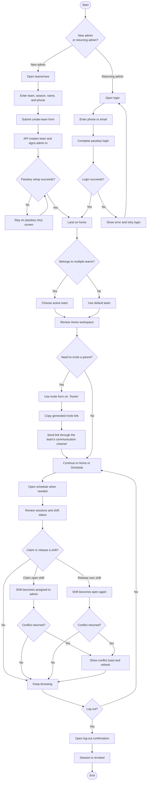
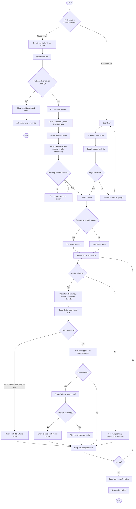

# Admin and User Flow Charts

This guide summarizes the currently shipped web MVP flows as Mermaid diagrams.
It complements [user-guide.md](./user-guide.md): that guide explains the same
behavior in prose, while this page shows the route and decision flow at a
glance.

For this document, **user** means a non-admin team member in the current MVP,
which is typically a **parent**.

## Admin flow

## User flow

## Notes

- Role is scoped per team. The same person can be an admin in one team and a
  parent in another.
- A returning user with an already registered passkey uses `/login`; a first
  join from an invite uses `/invite/[code]`.
- Current admin-only web UI is limited to team creation, invite generation from
  `/home`, and any shared shift claim/release actions already available to all
  members. Full admin schedule, roster, and member-management screens are still
  planned rather than shipped.
