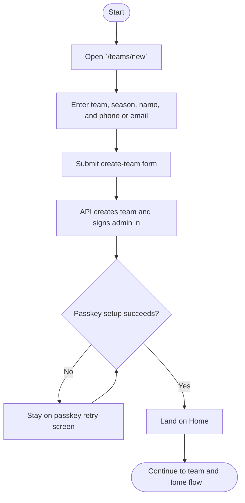
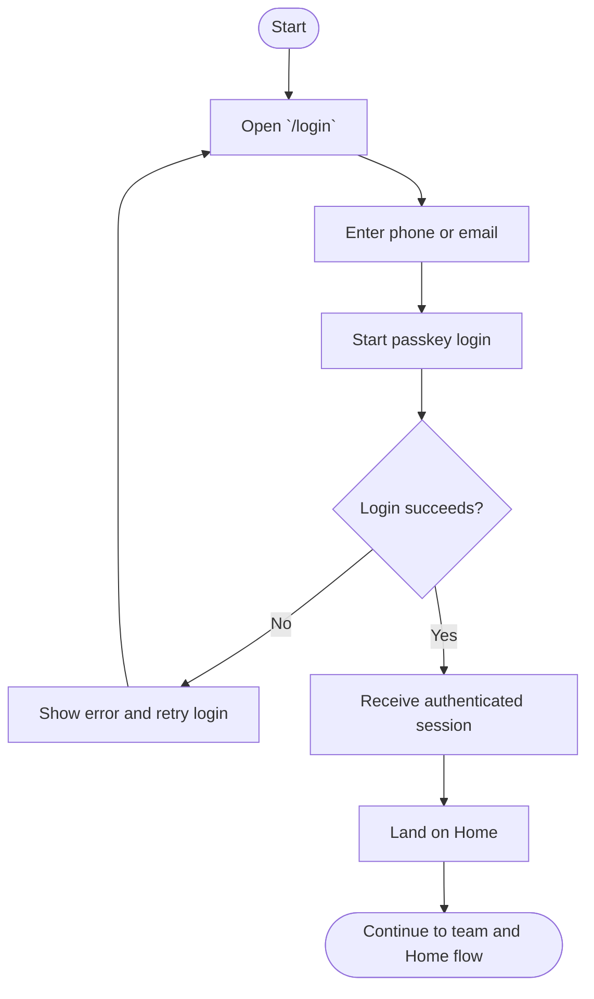
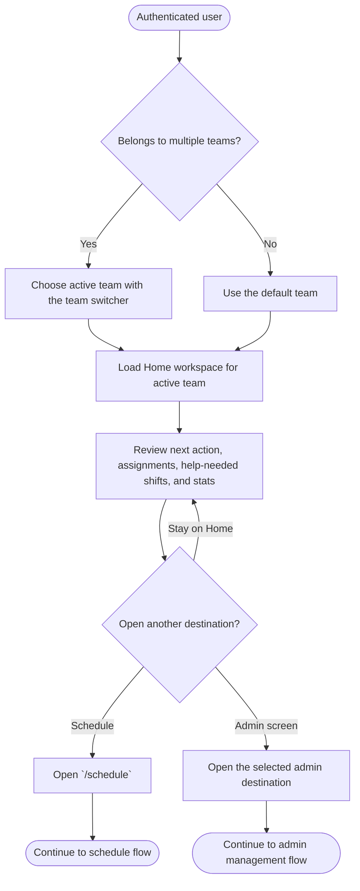
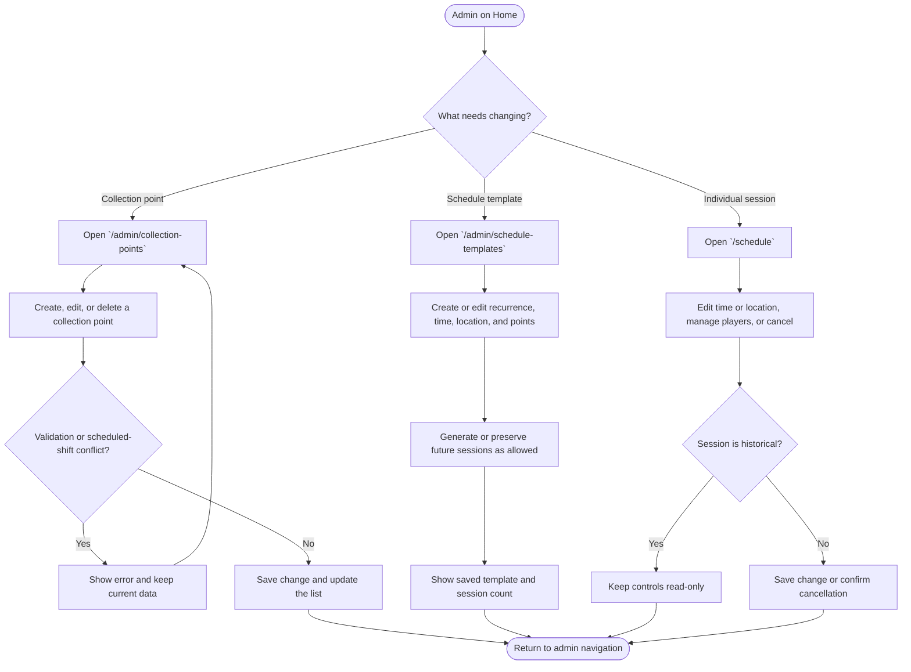
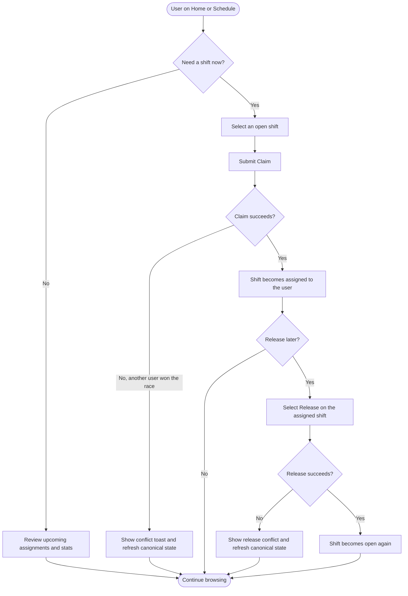
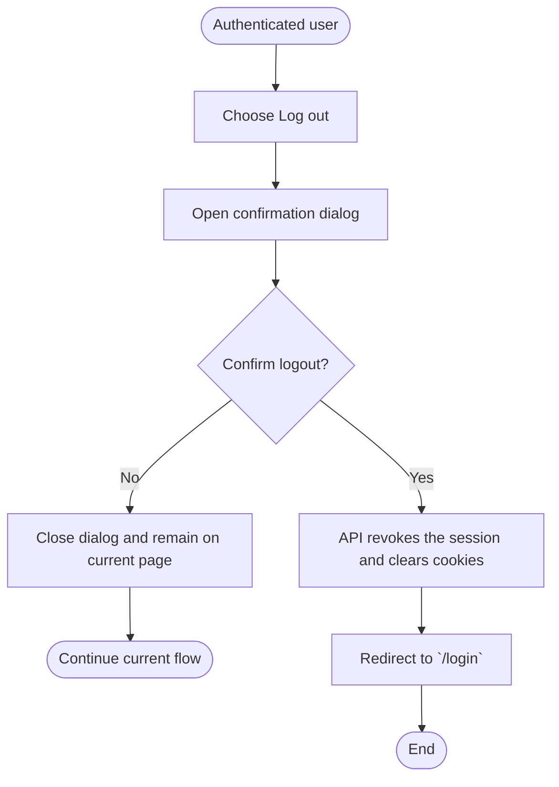

# Admin and User Flow Charts

This guide summarizes the currently shipped web MVP flows as separate Mermaid
diagrams. Each chart covers one focused journey so it can be read, reviewed,
and updated independently.

It complements [user-guide.md](./user-guide.md): that guide explains the same
behavior in prose, while this page shows the route and decision flow at a
glance.

For this document, **user** means a non-admin team member in the current MVP,
which is typically a **parent**.

## Admin creates a team



## User accepts an invite

```mermaid
flowchart TD
    A([Start]) --> B[Receive invite link from an admin]
    B --> C[Open `/invite/[code]`]
    C --> D{Invite exists and is still pending?}
    D -->|No| E[Show invalid or expired state]
    E --> F[Ask admin for a new invite]
    F --> G([End])
    D -->|Yes| H[Review team preview]
    H --> I[Enter name and optional linked players]
    I --> J[Submit join-team form]
    J --> K[API accepts invite and creates or links membership]
    K --> L{Passkey setup succeeds?}
    L -->|No| M[Stay on passkey retry screen]
    M --> L
    L -->|Yes| N[Land on Home]
    N --> O([Continue to team and Home flow])
```

## User signs in with a passkey



## User selects a team and reviews Home



## Admin manages schedule data



## User claims or releases a shift



## User logs out



## Notes

- The team and Home flow is shared by admins and parents; available admin
  destinations are determined by the active membership role.
- A returning user with an already registered passkey uses `/login`; a first
  join from an invite uses `/invite/[code]`.
- A user can claim or release each direction independently. The API remains
  authoritative when concurrent actions produce a conflict.
- Current admin UI covers collection points, schedule templates, individual
  session management, team invites, and shared shift actions. Future admin
  operations remain tracked in [PLAN.md](../PLAN.md).
