# Admin and Parent Flow Charts

This guide shows the currently shipped web flows in two role-specific sections.
Every scenario has its own Mermaid diagram so it can be read, reviewed, and
updated independently.

Admin permissions are scoped to a team. A person may therefore follow an admin
flow for one team and a parent flow for another. See the
[Admin User Guide](./admin-user-guide.md) and [User Guide](./user-guide.md) for
the same behavior in prose.

## Admin flows

### Admin creates a team

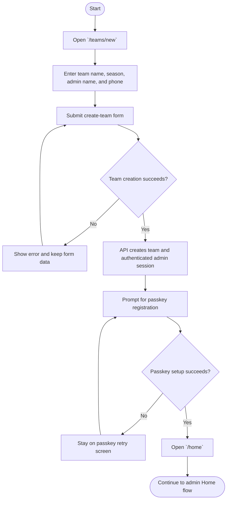
```mermaid
flowchart TD
    A([Start]) --> B[Open `/teams/new`]
    B --> C[Enter team name, season, admin name, and phone]
    C --> D[Submit create-team form]
    D --> E{Team creation succeeds?}
    E -->|No| F[Show error and keep form data]
    F --> D
    E -->|Yes| G[API creates team and authenticated admin session]
    G --> H[Prompt for passkey registration]
    H --> I{Passkey setup succeeds?}
    I -->|No| J[Stay on passkey retry screen]
    J --> H
    I -->|Yes| K[Open `/home`]
    K --> L([Continue to admin Home flow])
```

### Returning admin signs in

```mermaid
flowchart TD
    A([Start]) --> B[Open `/login`]
    B --> C[Enter phone or email on file]
    C --> D[Start passkey login]
    D --> E{Login succeeds?}
    E -->|No| F[Show error]
    F --> B
    E -->|Yes| G[Create authenticated session]
    G --> H[Open `/home`]
    H --> I([Continue to admin Home flow])
```

### Admin selects a team and reviews Home

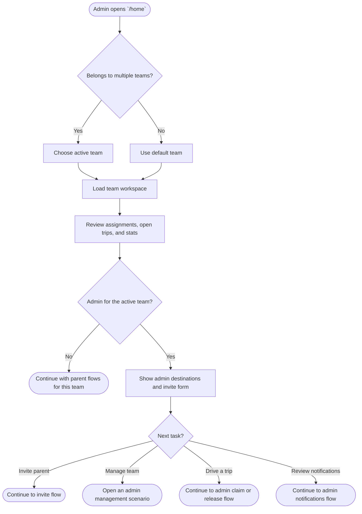
```mermaid
flowchart TD
    A([Admin opens `/home`]) --> B{Belongs to multiple teams?}
    B -->|Yes| C[Choose active team]
    B -->|No| D[Use default team]
    C --> E[Load team workspace]
    D --> E
    E --> F[Review assignments, open trips, and stats]
    F --> G{Admin for the active team?}
    G -->|No| H([Continue with parent flows for this team])
    G -->|Yes| I[Show admin destinations and invite form]
    I --> J{Next task?}
    J -->|Invite parent| K([Continue to invite flow])
    J -->|Manage team| L([Open an admin management scenario])
    J -->|Drive a trip| M([Continue to admin claim or release flow])
    J -->|Review notifications| N([Continue to admin notifications flow])
```

### Admin invites a parent

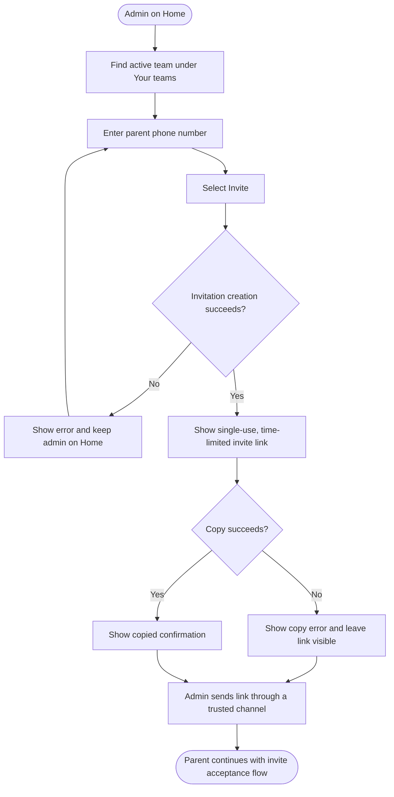
```mermaid
flowchart TD
    A([Admin on Home]) --> B[Find active team under Your teams]
    B --> C[Enter parent phone number]
    C --> D[Select Invite]
    D --> E{Invitation creation succeeds?}
    E -->|No| F[Show error and keep admin on Home]
    F --> C
    E -->|Yes| G[Show single-use, time-limited invite link]
    G --> H{Copy succeeds?}
    H -->|No| I[Show copy error and leave link visible]
    H -->|Yes| J[Show copied confirmation]
    I --> K[Admin sends link through a trusted channel]
    J --> K
    K --> L([Parent continues with invite acceptance flow])
```

### Admin manages collection points

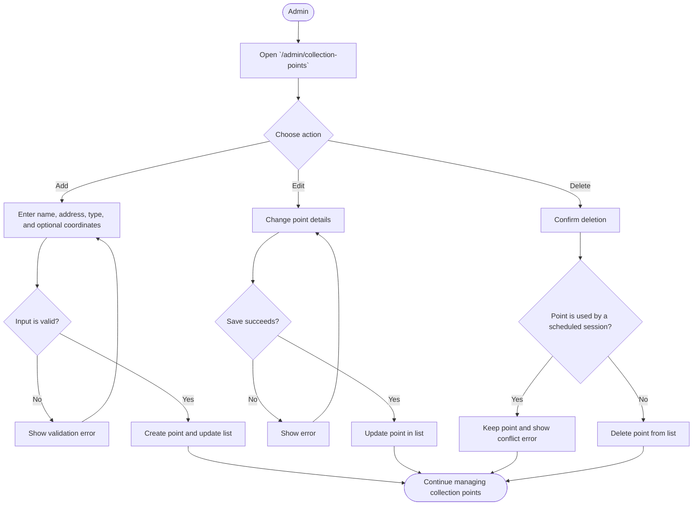
```mermaid
flowchart TD
    A([Admin]) --> B[Open `/admin/collection-points`]
    B --> C{Choose action}
    C -->|Add| D[Enter name, address, type, and optional coordinates]
    D --> E{Input is valid?}
    E -->|No| F[Show validation error]
    F --> D
    E -->|Yes| G[Create point and update list]
    C -->|Edit| H[Change point details]
    H --> I{Save succeeds?}
    I -->|No| J[Show error]
    J --> H
    I -->|Yes| K[Update point in list]
    C -->|Delete| L[Confirm deletion]
    L --> M{Point is used by a scheduled session?}
    M -->|Yes| N[Keep point and show conflict error]
    M -->|No| O[Delete point from list]
    G --> P([Continue managing collection points])
    K --> P
    N --> P
    O --> P
```

### Admin creates a schedule template

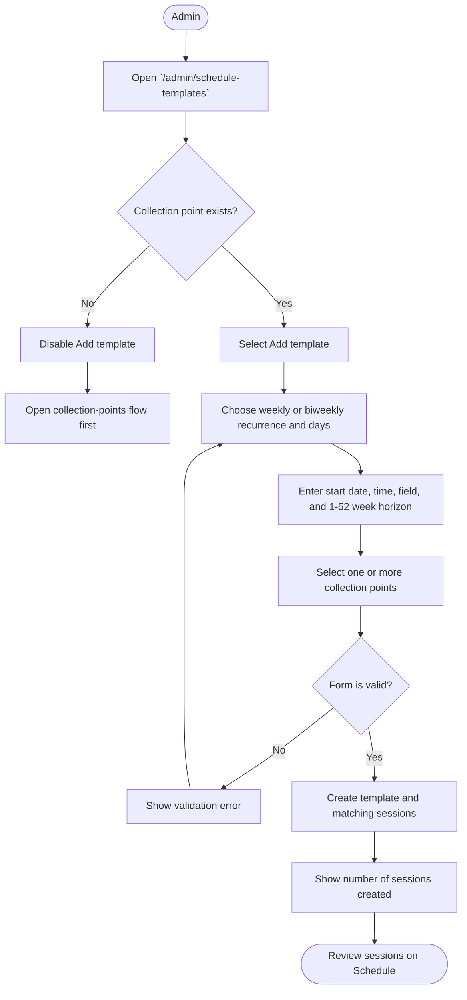
```mermaid
flowchart TD
    A([Admin]) --> B[Open `/admin/schedule-templates`]
    B --> C{Collection point exists?}
    C -->|No| D[Disable Add template]
    D --> E[Open collection-points flow first]
    C -->|Yes| F[Select Add template]
    F --> G[Choose weekly or biweekly recurrence and days]
    G --> H[Enter start date, time, field, and 1-52 week horizon]
    H --> I[Select one or more collection points]
    I --> J{Form is valid?}
    J -->|No| K[Show validation error]
    K --> G
    J -->|Yes| L[Create template and matching sessions]
    L --> M[Show number of sessions created]
    M --> N([Review sessions on Schedule])
```

### Admin edits a schedule template

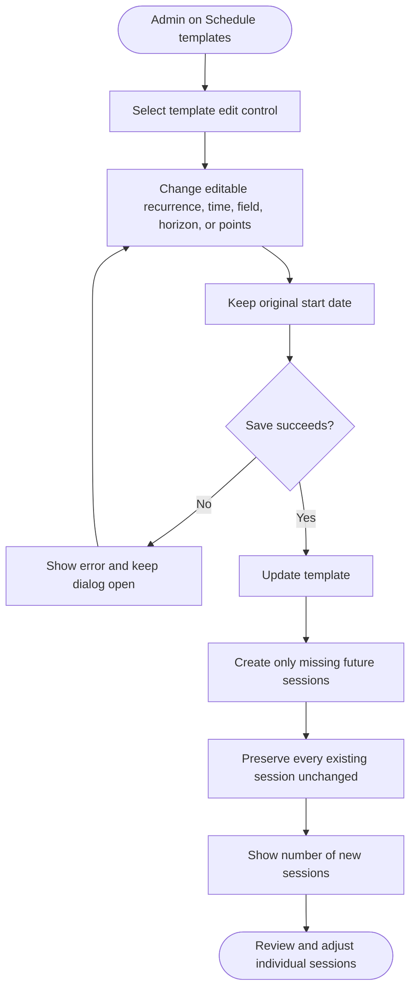
```mermaid
flowchart TD
    A([Admin on Schedule templates]) --> B[Select template edit control]
    B --> C[Change editable recurrence, time, field, horizon, or points]
    C --> D[Keep original start date]
    D --> E{Save succeeds?}
    E -->|No| F[Show error and keep dialog open]
    F --> C
    E -->|Yes| G[Update template]
    G --> H[Create only missing future sessions]
    H --> I[Preserve every existing session unchanged]
    I --> J[Show number of new sessions]
    J --> K([Review and adjust individual sessions])
```

### Admin manages an individual session

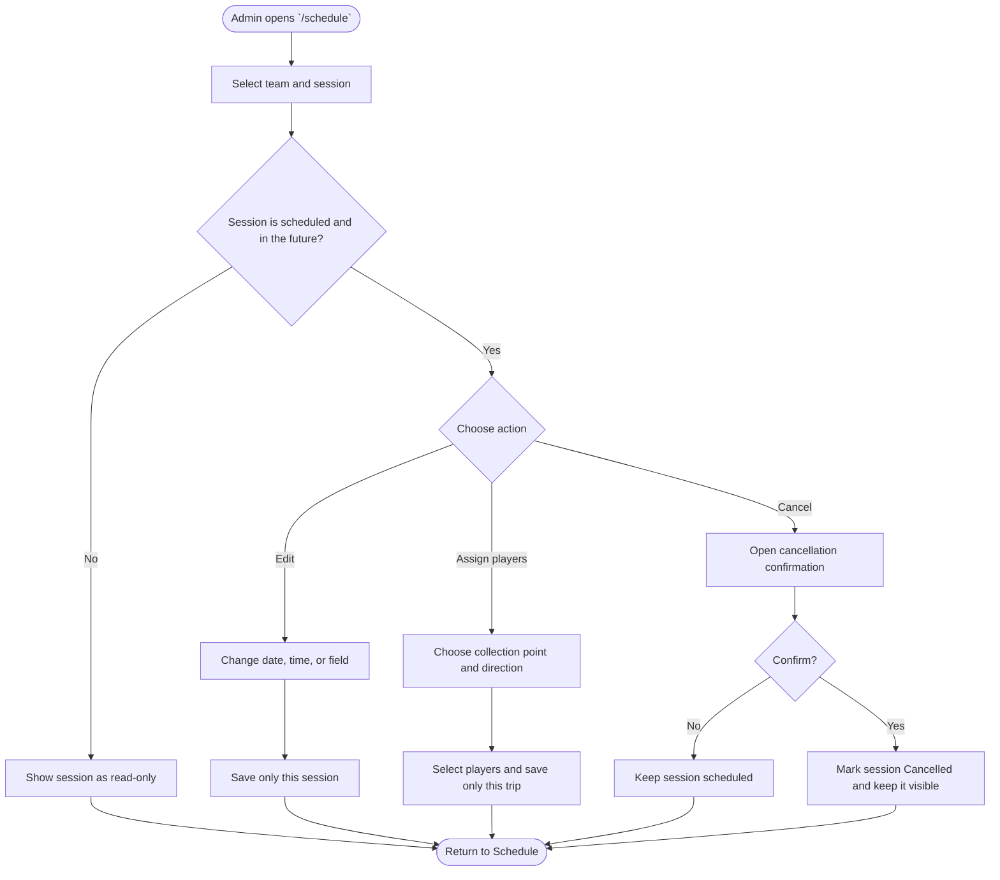
```mermaid
flowchart TD
    A([Admin opens `/schedule`]) --> B[Select team and session]
    B --> C{Session is scheduled and in the future?}
    C -->|No| D[Show session as read-only]
    C -->|Yes| E{Choose action}
    E -->|Edit| F[Change date, time, or field]
    F --> G[Save only this session]
    E -->|Assign players| H[Choose collection point and direction]
    H --> I[Select players and save only this trip]
    E -->|Cancel| J[Open cancellation confirmation]
    J --> K{Confirm?}
    K -->|No| L[Keep session scheduled]
    K -->|Yes| M[Mark session Cancelled and keep it visible]
    D --> N([Return to Schedule])
    G --> N
    I --> N
    L --> N
    M --> N
```

### Admin configures team coordination settings

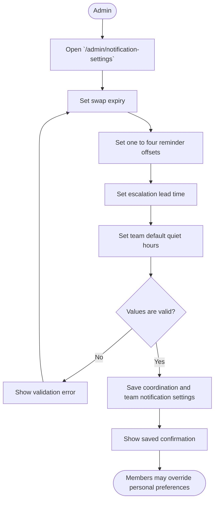
```mermaid
flowchart TD
    A([Admin]) --> B[Open `/admin/notification-settings`]
    B --> C[Set swap expiry]
    C --> D[Set one to four reminder offsets]
    D --> E[Set escalation lead time]
    E --> F[Set team default quiet hours]
    F --> G{Values are valid?}
    G -->|No| H[Show validation error]
    H --> C
    G -->|Yes| I[Save coordination and team notification settings]
    I --> J[Show saved confirmation]
    J --> K([Members may override personal preferences])
```

### Admin claims or releases a trip

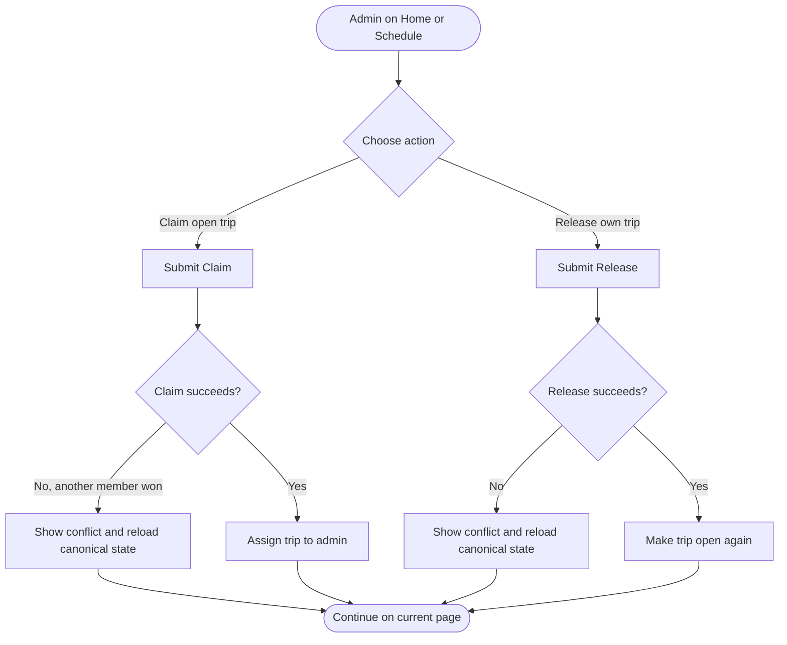
```mermaid
flowchart TD
    A([Admin on Home or Schedule]) --> B{Choose action}
    B -->|Claim open trip| C[Submit Claim]
    C --> D{Claim succeeds?}
    D -->|No, another member won| E[Show conflict and reload canonical state]
    D -->|Yes| F[Assign trip to admin]
    B -->|Release own trip| G[Submit Release]
    G --> H{Release succeeds?}
    H -->|No| I[Show conflict and reload canonical state]
    H -->|Yes| J[Make trip open again]
    E --> K([Continue on current page])
    F --> K
    I --> K
    J --> K
```

### Admin requests a shift swap

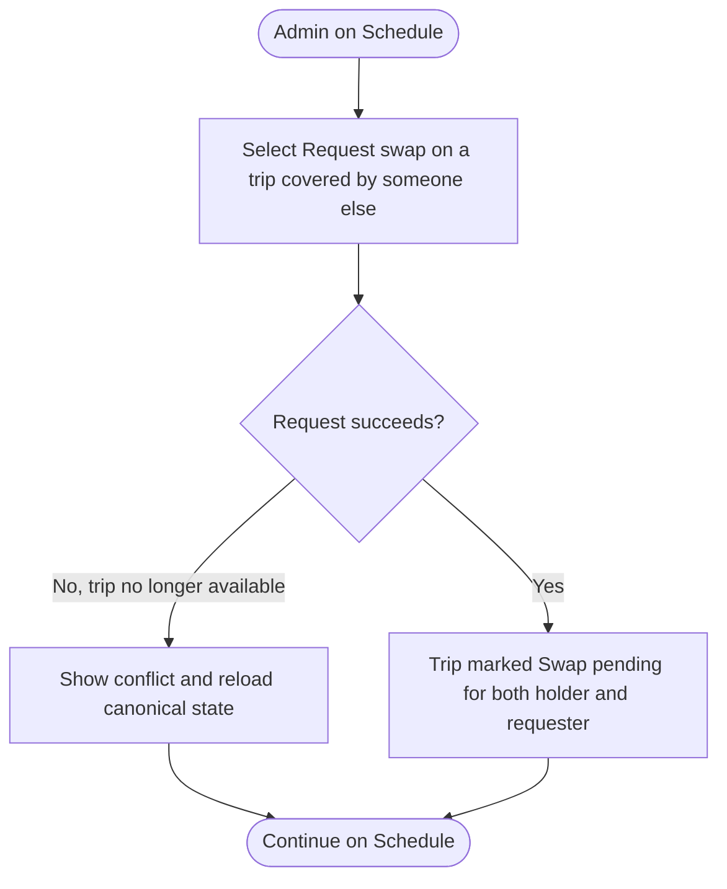
```mermaid
flowchart TD
    A([Admin on Schedule]) --> B[Select Request swap on a trip covered by someone else]
    B --> C{Request succeeds?}
    C -->|No, trip no longer available| D[Show conflict and reload canonical state]
    C -->|Yes| E[Trip marked Swap pending for both holder and requester]
    D --> F([Continue on Schedule])
    E --> F
```

### Admin responds to or cancels a shift swap

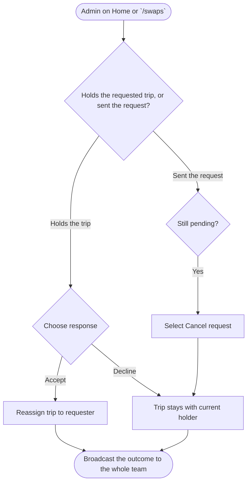
```mermaid
flowchart TD
    A([Admin on Home or `/swaps`]) --> B{Holds the requested trip, or sent the request?}
    B -->|Holds the trip| C{Choose response}
    C -->|Accept| D[Reassign trip to requester]
    C -->|Decline| E[Trip stays with current holder]
    B -->|Sent the request| F{Still pending?}
    F -->|Yes| G[Select Cancel request]
    G --> E
    D --> H([Broadcast the outcome to the whole team])
    E --> H
```

### Admin reviews team notifications

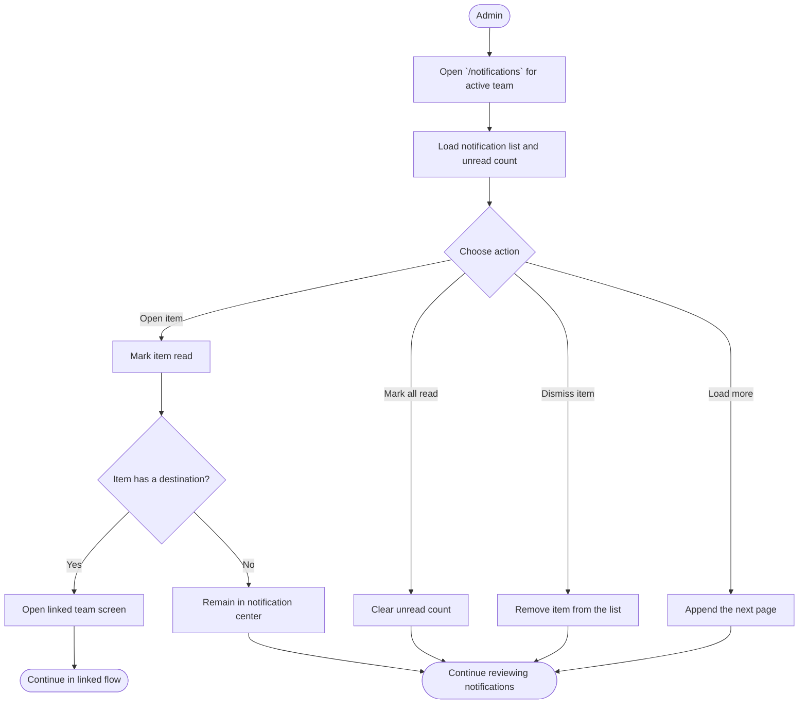
```mermaid
flowchart TD
    A([Admin]) --> B[Open `/notifications` for active team]
    B --> C[Load notification list and unread count]
    C --> D{Choose action}
    D -->|Open item| E[Mark item read]
    E --> F{Item has a destination?}
    F -->|Yes| G[Open linked team screen]
    F -->|No| H[Remain in notification center]
    D -->|Mark all read| I[Clear unread count]
    D -->|Dismiss item| J[Remove item from the list]
    D -->|Load more| K[Append the next page]
    G --> L([Continue in linked flow])
    H --> M([Continue reviewing notifications])
    I --> M
    J --> M
    K --> M
```

### Admin sets personal notification preferences

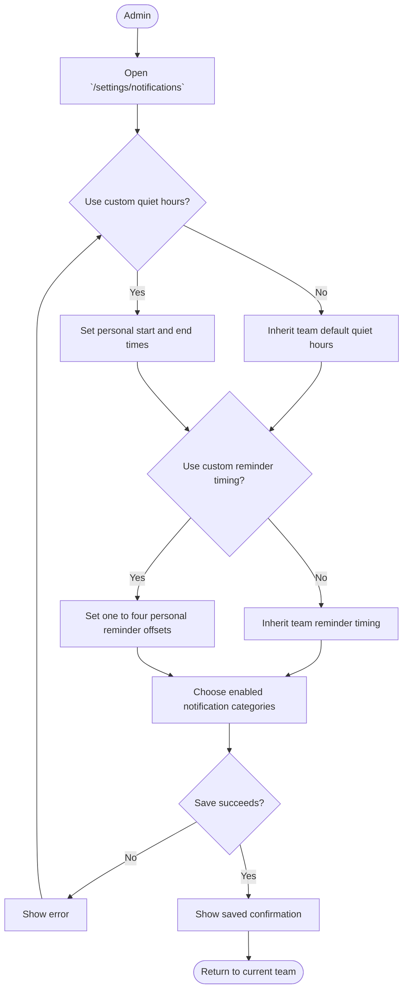
```mermaid
flowchart TD
    A([Admin]) --> B[Open `/settings/notifications`]
    B --> C{Use custom quiet hours?}
    C -->|No| D[Inherit team default quiet hours]
    C -->|Yes| E[Set personal start and end times]
    D --> F{Use custom reminder timing?}
    E --> F
    F -->|No| G[Inherit team reminder timing]
    F -->|Yes| H[Set one to four personal reminder offsets]
    G --> I[Choose enabled notification categories]
    H --> I
    I --> J{Save succeeds?}
    J -->|No| K[Show error]
    K --> C
    J -->|Yes| L[Show saved confirmation]
    L --> M([Return to current team])
```

### Admin enables browser push notifications

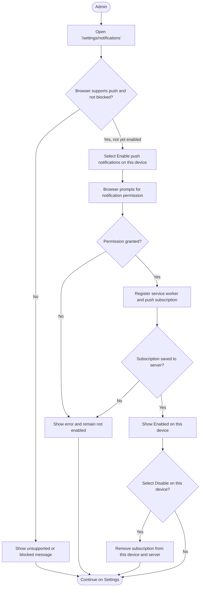
```mermaid
flowchart TD
    A([Admin]) --> B[Open `/settings/notifications`]
    B --> C{Browser supports push and not blocked?}
    C -->|No| D[Show unsupported or blocked message]
    D --> Z([Continue on Settings])
    C -->|Yes, not yet enabled| E[Select Enable push notifications on this device]
    E --> F[Browser prompts for notification permission]
    F --> G{Permission granted?}
    G -->|No| H[Show error and remain not enabled]
    H --> Z
    G -->|Yes| I[Register service worker and push subscription]
    I --> J{Subscription saved to server?}
    J -->|No| H
    J -->|Yes| K[Show Enabled on this device]
    K --> L{Select Disable on this device?}
    L -->|Yes| M[Remove subscription from this device and server]
    M --> Z
    L -->|No| Z
```

### Admin logs out

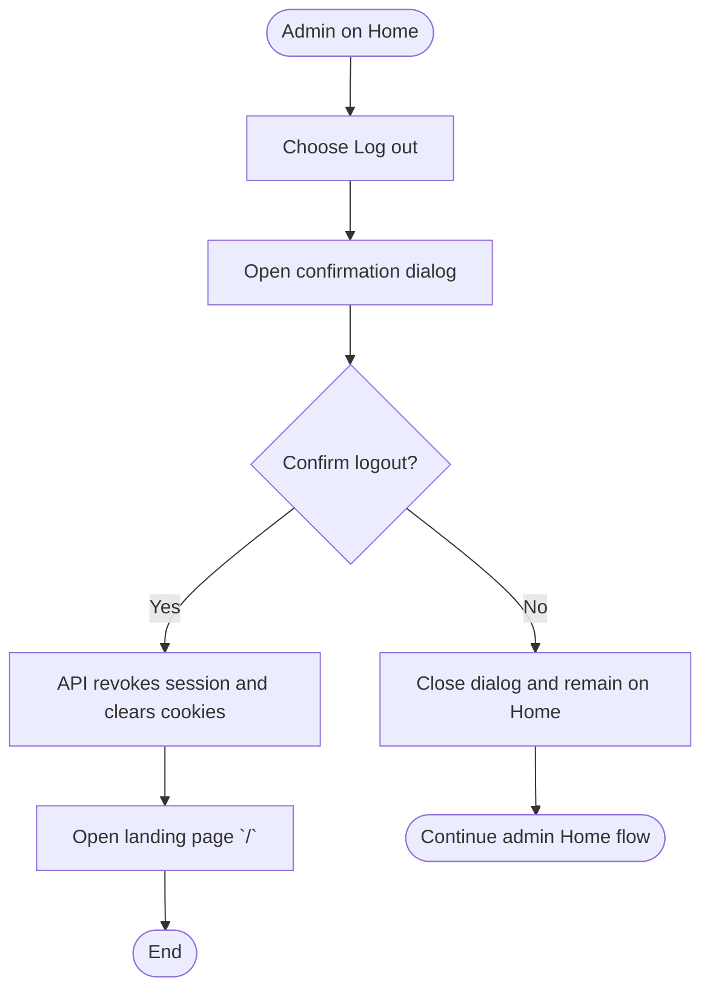
```mermaid
flowchart TD
    A([Admin on Home]) --> B[Choose Log out]
    B --> C[Open confirmation dialog]
    C --> D{Confirm logout?}
    D -->|No| E[Close dialog and remain on Home]
    D -->|Yes| F[API revokes session and clears cookies]
    F --> G[Open landing page `/`]
    E --> H([Continue admin Home flow])
    G --> I([End])
```

## Parent flows

### Parent accepts an invite

```mermaid
flowchart TD
    A([Parent receives invite link]) --> B[Open `/invite/[code]`]
    B --> C{Invite exists, is pending, and has not expired?}
    C -->|No| D[Show invalid or expired state]
    D --> E[Ask admin for a new invite]
    E --> F([End])
    C -->|Yes| G[Review team preview]
    G --> H[Enter name and optional linked players]
    H --> I[Submit join-team form]
    I --> J{Invite acceptance succeeds?}
    J -->|No| K[Show error]
    K --> B
    J -->|Yes| L[Create or link parent membership]
    L --> M[Prompt for passkey registration]
    M --> N{Passkey setup succeeds?}
    N -->|No| O[Stay on passkey retry screen]
    O --> M
    N -->|Yes| P[Open `/home`]
    P --> Q([Continue to parent Home flow])
```

### Returning parent signs in

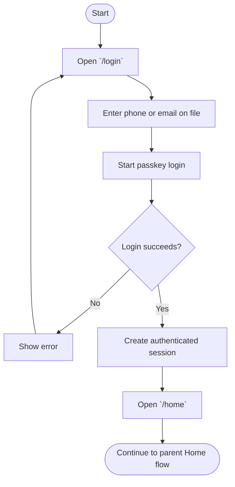
```mermaid
flowchart TD
    A([Start]) --> B[Open `/login`]
    B --> C[Enter phone or email on file]
    C --> D[Start passkey login]
    D --> E{Login succeeds?}
    E -->|No| F[Show error]
    F --> B
    E -->|Yes| G[Create authenticated session]
    G --> H[Open `/home`]
    H --> I([Continue to parent Home flow])
```

### Parent opens an onboarded team and reviews Home

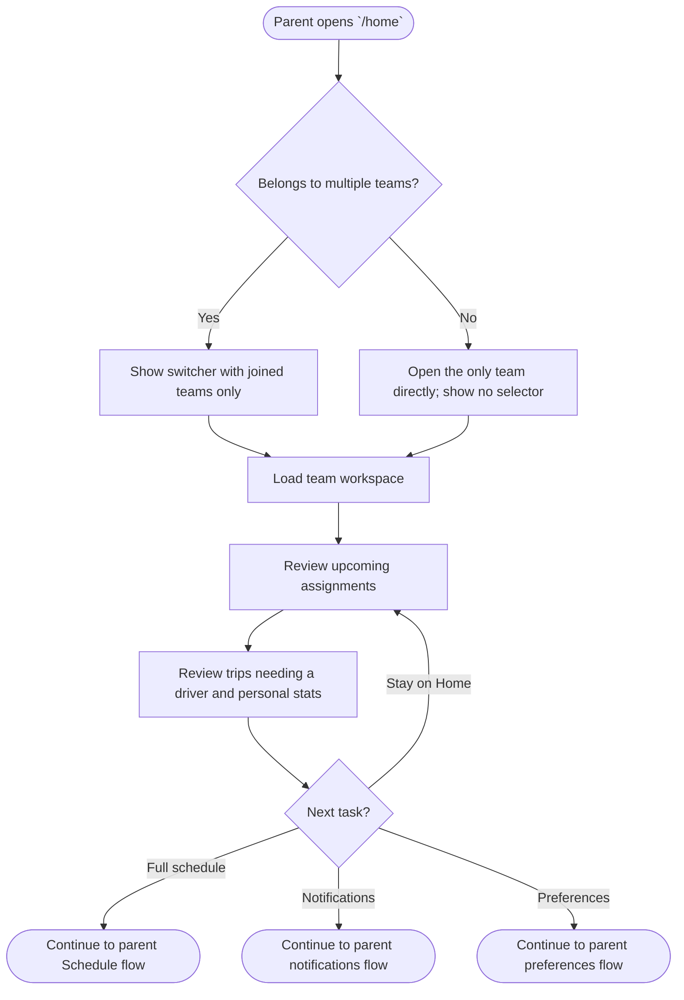
```mermaid
flowchart TD
    A([Parent opens `/home`]) --> B{Belongs to multiple teams?}
    B -->|Yes| C[Show switcher with joined teams only]
    B -->|No| D[Open the only team directly; show no selector]
    C --> E[Load team workspace]
    D --> E
    E --> F[Review upcoming assignments]
    F --> G[Review trips needing a driver and personal stats]
    G --> H{Next task?}
    H -->|Full schedule| I([Continue to parent Schedule flow])
    H -->|Notifications| J([Continue to parent notifications flow])
    H -->|Preferences| K([Continue to parent preferences flow])
    H -->|Stay on Home| F
```

### Parent reviews Schedule and trip coverage

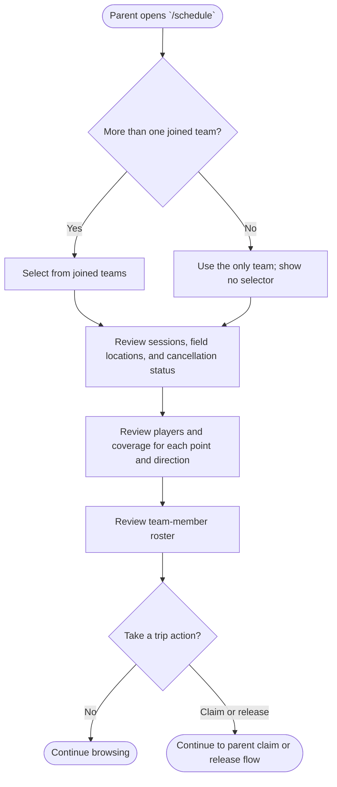
```mermaid
flowchart TD
    A([Parent opens `/schedule`]) --> B{More than one joined team?}
    B -->|Yes| C[Select from joined teams]
    B -->|No| D[Use the only team; show no selector]
    C --> E[Review sessions, field locations, and cancellation status]
    D --> E
    E --> F[Review players and coverage for each point and direction]
    F --> G[Review team-member roster]
    G --> H{Take a trip action?}
    H -->|No| I([Continue browsing])
    H -->|Claim or release| J([Continue to parent claim or release flow])
```

### Parent claims or releases a trip

```mermaid
flowchart TD
    A([Parent on Home or Schedule]) --> B{Choose action}
    B -->|Claim open trip| C[Submit Claim]
    C --> D{Claim succeeds?}
    D -->|No, another member won| E[Show conflict and reload canonical state]
    D -->|Yes| F[Assign trip to parent]
    B -->|Release own trip| G[Submit Release]
    G --> H{Release succeeds?}
    H -->|No| I[Show conflict and reload canonical state]
    H -->|Yes| J[Make trip open again]
    E --> K([Continue on current page])
    F --> K
    I --> K
    J --> K
```

### Parent requests a shift swap

```mermaid
flowchart TD
    A([Parent on Schedule]) --> B[Select Request swap on a trip covered by someone else]
    B --> C{Request succeeds?}
    C -->|No, trip no longer available| D[Show conflict and reload canonical state]
    C -->|Yes| E[Trip marked Swap pending for both holder and requester]
    D --> F([Continue on Schedule])
    E --> F
```

### Parent responds to or cancels a shift swap

```mermaid
flowchart TD
    A([Parent on Home or `/swaps`]) --> B{Holds the requested trip, or sent the request?}
    B -->|Holds the trip| C{Choose response}
    C -->|Accept| D[Reassign trip to requester]
    C -->|Decline| E[Trip stays with current holder]
    B -->|Sent the request| F{Still pending?}
    F -->|Yes| G[Select Cancel request]
    G --> E
    D --> H([Broadcast the outcome to the whole team])
    E --> H
```

### Parent reviews team notifications

```mermaid
flowchart TD
    A([Parent]) --> B[Open `/notifications` for active team]
    B --> C[Load notification list and unread count]
    C --> D{Choose action}
    D -->|Open item| E[Mark item read]
    E --> F{Item has a destination?}
    F -->|Yes| G[Open linked team screen]
    F -->|No| H[Remain in notification center]
    D -->|Mark all read| I[Clear unread count]
    D -->|Dismiss item| J[Remove item from the list]
    D -->|Load more| K[Append the next page]
    G --> L([Continue in linked flow])
    H --> M([Continue reviewing notifications])
    I --> M
    J --> M
    K --> M
```

### Parent sets personal notification preferences

```mermaid
flowchart TD
    A([Parent]) --> B[Open `/settings/notifications`]
    B --> C{Use custom quiet hours?}
    C -->|No| D[Inherit team default quiet hours]
    C -->|Yes| E[Set personal start and end times]
    D --> F{Use custom reminder timing?}
    E --> F
    F -->|No| G[Inherit team reminder timing]
    F -->|Yes| H[Set one to four personal reminder offsets]
    G --> I[Choose enabled notification categories]
    H --> I
    I --> J{Save succeeds?}
    J -->|No| K[Show error]
    K --> C
    J -->|Yes| L[Show saved confirmation]
    L --> M([Return to current team])
```

### Parent enables browser push notifications

```mermaid
flowchart TD
    A([Parent]) --> B[Open `/settings/notifications`]
    B --> C{Browser supports push and not blocked?}
    C -->|No| D[Show unsupported or blocked message]
    D --> Z([Continue on Settings])
    C -->|Yes, not yet enabled| E[Select Enable push notifications on this device]
    E --> F[Browser prompts for notification permission]
    F --> G{Permission granted?}
    G -->|No| H[Show error and remain not enabled]
    H --> Z
    G -->|Yes| I[Register service worker and push subscription]
    I --> J{Subscription saved to server?}
    J -->|No| H
    J -->|Yes| K[Show Enabled on this device]
    K --> L{Select Disable on this device?}
    L -->|Yes| M[Remove subscription from this device and server]
    M --> Z
    L -->|No| Z
```

### Parent logs out

```mermaid
flowchart TD
    A([Parent on Home]) --> B[Choose Log out]
    B --> C[Open confirmation dialog]
    C --> D{Confirm logout?}
    D -->|No| E[Close dialog and remain on Home]
    D -->|Yes| F[API revokes session and clears cookies]
    F --> G[Open landing page `/`]
    E --> H([Continue parent Home flow])
    G --> I([End])
```

## Shared behavior and current boundaries

- Team selectors contain only the account's current memberships and are hidden
  entirely for single-team parents. Every team switch reloads data in the
  selected team's scope. Admin-only
  destinations appear only when the active membership has the admin role.
- First-time parents register a passkey through their invite. Returning admins
  and parents use `/login` on a device with a registered passkey.
- Trips to practice and from practice are independent. A member can claim or
  release one direction without changing the other.
- Claim and release conflicts reload server state because the API is
  authoritative when members act concurrently.
- Past and cancelled sessions are read-only. Template edits add missing future
  sessions but never rewrite sessions that already exist.
- The notification center updates live while it stays open — new items
  delivered by the server appear without a manual reload. If a live
  connection can't be kept open, the list still catches up automatically
  within a short interval, and always on the next visit or explicit reload.
- Opening a notification linked to a specific session or shift scrolls to and
  briefly highlights that row on Schedule, instead of only opening the
  team's full schedule.
- Browser push is an opt-in, per-device addition to the in-app notification
  center, not a replacement for it — every event still appears in full there
  regardless of push settings. Push respects the same category and
  quiet-hours preferences shown above, and a rapid burst of unrelated events
  for one team collapses into a single summary push rather than one per
  event. It requires the server operator to have configured push credentials;
  if unavailable, the Settings page explains that instead of offering the
  enable control.
- Following a link to a page that requires sign-in while signed out returns to
  that exact page — including its parameters, such as a notification's linked
  session or shift — once sign-in completes, instead of always landing on
  Home.
- A trip with a pending swap request shows a distinct "Swap pending" status
  and can't be claimed, released, or requested again by someone else until
  the request resolves — accepted, declined, cancelled by the requester, or
  expired automatically after the team's configured swap-expiry window
  (always capped at the session's own start time). Every swap request,
  response, cancellation, and expiry is broadcast to the whole team, the
  same as a claim or release, and every past request stays visible on
  `/swaps` for transparency regardless of who was involved.
- Member and role management, reporting, and audit-log screens are not yet
  part of the shipped web flows. See [PLAN.md](../PLAN.md) for their delivery
  status.
